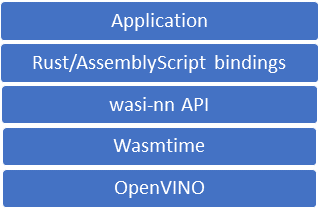
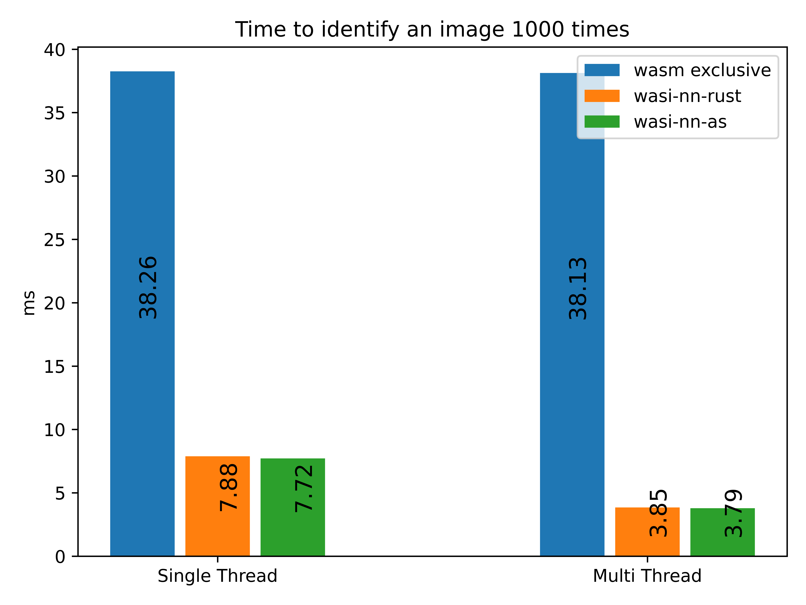

# **Utilizing wasi-nn from AssemblyScript**
JavaScript is one of the most popular programming languages today, and is used in a wide range of places outside the browser. A lot of what makes it popular is it's low entry barrier and abundance of ready to use libraries, making it easy to get started and make something great. However, due to the nature of being a script language, its not always the most performant option, and often it can be difficult (or impossible) to access powerful low level capabilities. AssemblyScript and The [wasi-nn proposal](https://github.com/WebAssembly/wasi-nn) are geared towards alleviating these shortcomings. AssemblyScipt allows your JavaScript code to be compiled down to WebAssembly(WASM), which performs much closer to native speeds. And wasi-nn gives WebAssembly programs access to host-provided machine learning (ML) functions. Effectively this can give us the best of both worlds. The speed and security of native code, along with the simplicity and quick development provided by AssemblyScript.

## **Benefits of AssemblyScript**
---
AssemblyScript is a variant of Typescript, meaning it should be very familiar to anyone who's accustomed to writing software with TypeScript or even plain JavaScript. This means its easy for JavaScript developers to jump in and get started, it also means porting other libraries is often possible as well. This makes AssemblyScript an attractive choice for developers working in the webspace, who want to get into machine learning but don't want to learn an entirely new language like Rust. To learn more about AssemblyScript you can visit [Assemblyscript.org](https://www.assemblyscript.org/).

## **Bindings for AssemblyScript to wasi-nn ([as-wasi-nn](https://www.npmjs.com/package/as-wasi-nn))**
---
These bindings provide access to the wasi-nn API calls provided by Wasmtime, as well as some useful objects to help in the creation of machine learning code. They give AssemblyScript developers an easy avenue for utilizing native machine learning frameworks in their projects, without the need to port their work to Rust. In addition, the performance of the compiled AssemblyScript code is almost as fast as Rust in most cases.



## **Performance**
---
The AssemblyScript wasi-nn bindings perform as well, or even slightly better, than the Rust wasi-nn bindings based on initial tests. Here are the results of identifying an image 1000 times. Measurments were taken using [sightglass](https://github.com/bytecodealliance/sightglass). This test utilizes the MobileNet v2 model.



## **Currently available functions and objects**
---
- Graph - Graph data object.
    -  load - Load a model using one or more opaque byte arrays.
    - initExecutionContext - Initialize the execution context.
- ExecutionContext - The context object. Provides the setInput and compute functions as well.
    - setInput - Bind tensors to the context.
    - compute - Computes the machine learning inference using the bound context.
    - getOutput - Retrieve the inference result tensors.
- Tensor - Tensor data object.
    - asPointer - Returns a pointer to the tensor object.
    - toArrayBuffer - Returns an ArrayBuffer with a copy of the bytes in this Tensor.
- GraphEncoding - Enum value for what graph encoder to use. Currently only supports OpenVino.
- ExecutionTarget - Enum value for what processor to use for computation. (cpu, gpu, or tpu).

## **Initial setup**
---
[OpenVino](https://docs.openvinotoolkit.org/latest/openvino_docs_install_guides_installing_openvino_linux.html) is one backend we use to implement the wasi-nn API, you'll need to install according to their instructions. Additional ML frameworks such ONNXRT are also supported.

And [Wasmtime](https://wasmtime.dev/) is the runtime we are using to execute our compiled WASM File.


Then you'll need to include the AssemblyScript bindings in your project.
```
npm install as-wasi-nn --save
```
You can find more info about the bindings on the [npmjs page](https://www.npmjs.com/package/as-wasi-nn) and the [github](https://github.com/bytecodealliance/wasi-nn).


## **An example**
---
You can find a code example on how to use these bindings in the [git repo](https://github.com/bytecodealliance/wasi-nn/tree/main/assemblyscript/examples). This example uses wasi-nn to identify items in pictures and uses a mobilenet test fixture, found [here.](https://github.com/intel/openvino-rs/raw/main/crates/openvino/tests/fixtures/mobilenet).

### **To run the example**
---
The easiest way to build the demo is to simply run `./build.sh as`. This will handle all the steps below for you.

To build it manually, first your wasm file using the AssemblyScript compiler, asc.
```
asc examples/object-classification.ts --use abort=examples/object-classification/wasi_abort --target release --enable simd
```

Then run the generated .wasm file with Wasmtime. Note that when we run the example we need to include our build directory so Wasmtime has access to the needed files, and use the experimental-wasi-nn flag to enable use of wasi-nn.
```
wasmtime run build/optimized.wasm --dir build --wasi-modules=experimental-wasi-nn
```
# Here are the five example images:


# The results of the example should look like this:
```
Loading graph...
Setting up execution context...
Running classification...
Top 5 results:
1.) Granny Smith : (948, 0.9188140034675598)
2.) orange : (950, 0.0009393439395353198)
3.) lemon : (951, 0.0008977577672339976)
4.) bell pepper : (945, 0.0008856360800564289)
5.) fig : (952, 0.0008745133527554572)
Running classification...
Top 5 results:
1.) electric locomotive : (547, 0.58052659034729)
2.) passenger car, coach, carriage : (705, 0.36921560764312746)
3.) streetcar, tram, tramcar, trolley, trolley car : (829, 0.018056120723485948)
4.) freight car : (565, 0.004567445255815983)
5.) school bus : (779, 0.000954450573772192)
Running classification...
Top 5 results:
1.) airliner : (404, 0.5056325197219849)
2.) warplane, military plane : (895, 0.17786045372486115)
3.) wing : (908, 0.1679902970790863)
4.) aircraft carrier, carrier, flattop, attack aircraft carrier : (403, 0.006297547835856676)
5.) parachute, chute : (701, 0.0024122039321810009)
Running classification...
Top 5 results:
1.) American egret, great white heron, Egretta albus : (132, 0.5950347185134888)
2.) crane : (134, 0.1970628947019577)
3.) sulphur-crested cockatoo, Kakatoe galerita, Cacatua galerita : (89, 0.02757474221289158)
4.) pelican : (144, 0.0153504041954875)
5.) park bench : (703, 0.007831098511815071)
Running classification...
Top 5 results:
1.) street sign : (919, 0.9473432898521423)
2.) traffic light, traffic signal, stoplight : (920, 0.013894777745008469)
3.) tobacco shop, tobacconist shop, tobacconist : (860, 0.011996874585747719)
4.) bakery, bakeshop, bakehouse : (415, 0.002859988249838352)
5.) barbershop : (424, 0.002460404299199581)
```
# What is new with wasi-nn

wasi-nn is growing in several ways: more ML backends and more devices.

## wasi-nn on GPU

On some cases on devices with GPU, it may make sense to offload machine learning inferencing to GPU due to power and performance considerations. With the OpenVINO backend, we verified that GPU support works as expected using wasi-nn’s GPU `execution_target`. The setup is not simple enough to describe here, requiring an [OpenCL runtime is required](https://software.intel.com/content/www/us/en/develop/articles/opencl-drivers.html) (e.g., this [Linux package distribution](https://github.com/intel/compute-runtime/blob/master/opencl/doc/DISTRIBUTIONS.md)) and ensuring that the integrated GPU is available to the runtime, but the classifications executed on the CPU also ran successfully on an integrated GPU. Note that choosing a GPU execution target may not make sense in all cases: for small models or constrained GPUs, the cost of moving data to and from the GPU may outweigh the benefits of parallel execution.

## wasi-nn with the ONNX backend

Radu Matei describes how to [implement wasi-nn using the ONNX backend](https://radu-matei.com/blog/wasi-nn-onnx/) and we plan to work with them to upstream support for multiple ML backends. 
